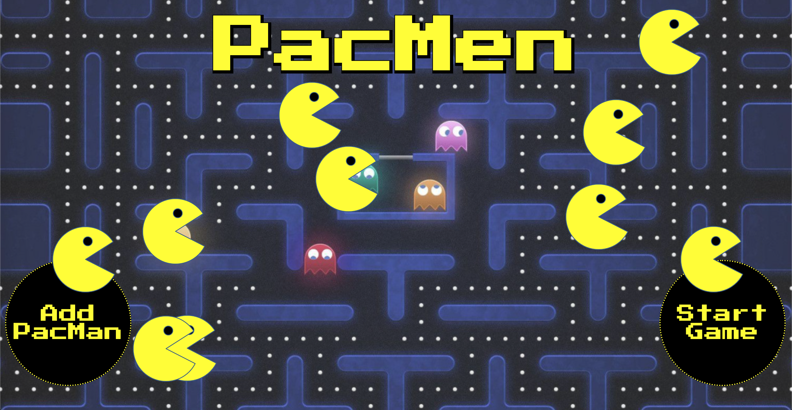

# PacMen
This assigment was completed for the MIT xPro Fullstack Development with MERN certificate program. Javascript, CSS, and HTML are combined to create an interactive page where the user can add as many PacMen as they would like, and make them all move independently once the Start Game button is clicked. 

<h2>To run:</h2>
Everything required to run this project is in this repository. You're welcome to fork and clone this repository, or you can just navigate to: https://ael-s.github.io/PacMen/. Press Add Pacman, then press Start Game to see them move!

<h2>Roadmap of future improvements:</h2>
I will eventually return to this code to further improve the styling of the buttons. I also plan to add some ghosts that will populate alongside the Pacmen. 

<h2>Support:</h2>
Feel free to email me at Aesteg89@gmail.com or message me on LinkedIn (https://www.linkedin.com/in/anna-stegmann-77825b136/) if you have any questions. 

<h2>License</h2>
MIT License
Copyright (c) 2022 Anna Stegmann

Permission is hereby granted, free of charge, to any person obtaining a copy of this software and associated documentation files (the "Software"), to deal in the Software without restriction, including without limitation the rights to use, copy, modify, merge, publish, distribute, sublicense, and/or sell copies of the Software, and to permit persons to whom the Software is furnished to do so, subject to the following conditions:

The above copyright notice and this permission notice shall be included in all copies or substantial portions of the Software.

THE SOFTWARE IS PROVIDED "AS IS", WITHOUT WARRANTY OF ANY KIND, EXPRESS OR IMPLIED, INCLUDING BUT NOT LIMITED TO THE WARRANTIES OF MERCHANTABILITY, FITNESS FOR A PARTICULAR PURPOSE AND NONINFRINGEMENT. IN NO EVENT SHALL THE AUTHORS OR COPYRIGHT HOLDERS BE LIABLE FOR ANY CLAIM, DAMAGES OR OTHER LIABILITY, WHETHER IN AN ACTION OF CONTRACT, TORT OR OTHERWISE, ARISING FROM, OUT OF OR IN CONNECTION WITH THE SOFTWARE OR THE USE OR OTHER DEALINGS IN THE SOFTWARE.
